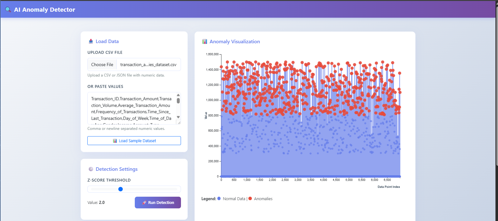

# AI Anomaly Detector — Lab Project



A modern web-based anomaly detection system that identifies statistical outliers in datasets using Z-score analysis with interactive D3.js visualizations.

## System Overview

The **AI Anomaly Detector** is designed to detect anomalies (outliers) in numeric datasets using statistical methods. It combines a PHP backend for robust data processing with an interactive JavaScript frontend for real-time visualization and threshold adjustment.

### Architecture

```
┌──────────────────┐         ┌──────────────────┐         ┌──────────────────┐
│   User Input     │         │  Data Validation │         │   Z-Score        │
│  (CSV/Manual)    │────────▶│   (PHP Backend)  │────────▶│   Calculation    │
└──────────────────┘         └──────────────────┘         └──────────────────┘
                                                                   │
                                                                   ▼
┌──────────────────┐         ┌──────────────────┐         ┌──────────────────┐
│  Interactive     │◀────────│  Results JSON    │◀────────│  Anomaly Flags   │
│  D3.js Chart     │         │   (REST API)     │         │   (|z| >= σ)     │
└──────────────────┘         └──────────────────┘         └──────────────────┘
```

## Key Features

✅ **Robust Anomaly Detection** — Z-score method with configurable sensitivity  
✅ **Interactive Visualizations** — D3.js line chart with hover tooltips and live updates  
✅ **Multiple Input Methods** — Manual entry, CSV uploads, or sample datasets  
✅ **Real-time Threshold Adjustment** — Slider control to explore different sensitivity levels  
✅ **Minimalist UI Design** — Clean, colorful interface with responsive Bootstrap layout  
✅ **Detailed Statistics** — Mean, standard deviation, and anomaly percentage display  

## Anomaly Detection Algorithm

### Z-Score Method

The Z-score (standard score) measures how many standard deviations a data point is from the mean:

```
z = (x - μ) / σ

Where:
  x  = individual data point
  μ  = mean of the dataset
  σ  = standard deviation
```

**Anomaly Detection Rule:**
- A data point is flagged as an anomaly if **|z| ≥ threshold**
- Default threshold: **2.0** (points beyond ±2 standard deviations)
- Sensitivity: Higher threshold = fewer anomalies, Lower threshold = more anomalies

**Why Z-Score?**
- Statistically sound and widely used in industry
- Works well with normally distributed data
- Simple to understand and configure
- Computationally efficient
- Robust when properly implemented

### Example

Dataset: `[10, 12, 11, 9, 13, 100]`
- Mean: 26.17
- Std Dev: 37.10
- Z-scores: `[-0.44, -0.38, -0.41, -0.46, -0.35, **1.96**]`
- With threshold 2.0: `[✓, ✓, ✓, ✓, ✓, **✗ Anomaly**]`

The value `100` stands out as an anomaly because its z-score (1.96) is near the threshold.

### File Descriptions

**`index.php`** — Frontend HTML structure
- Bootstrap 5 responsive layout
- Input panels for data loading and threshold control
- D3.js chart container
- Results summary display with statistics

**`app.js`** — JavaScript Client Logic
- Parses user input (CSV, JSON, manual values)
- Communicates with backend via Fetch API
- Renders interactive D3.js visualizations
- Handles threshold slider for live updates
- Implements hover tooltips and data interactivity

**`detect.php`** — PHP Backend API
- Accepts numeric data via POST request
- Parses CSV files with or without headers
- Computes statistical metrics (mean, std dev)
- Calculates Z-scores for each data point
- Flags anomalies based on threshold
- Returns JSON results for frontend rendering

**`style.css`** — Minimalist Colorful Design
- Gradient backgrounds (purple to violet)
- Smooth shadows and transitions
- Responsive typography
- Mobile-friendly layout
- Color-coded elements (normal: blue, anomalies: red)

## How to Run

### Prerequisites
- PHP 7.0+ with built-in web server or XAMPP/WAMP
- Modern web browser with D3.js support
- Sample CSV data (optional)

### Quick Start

1. **Navigate to project directory:**
   ```bash
   cd /path/to/anomaly-detection
   ```

2. **Start PHP development server:**
   ```bash
   php -S localhost:8000
   ```

3. **Open in browser:**
   ```
   http://localhost:8000
   ```

### Usage

1. **Load Data:**
   - Click **"Load Sample Dataset"** for demo data
   - Or paste comma/newline-separated numeric values
   - Or upload a CSV file (with or without headers)

2. **Run Detection:**
   - Adjust Z-score threshold using the slider (0.5-5.0)
   - Click **"Run Detection"** button
   - Results display immediately

3. **Explore Results:**
   - View statistics: Mean, Std Dev, Threshold
   - Hover over chart points for detailed tooltips
   - See anomaly count and percentage
   - Adjust threshold to re-run detection

## Sample Datasets

### `data/sample.csv`
Simple dataset with one clear outlier:
```
10, 12, 11, 9, 13, 150
```
Expected result: `150` flagged as anomaly

### `data/transaction_anomalies_dataset.csv`
Real-world transaction amounts with known anomalies. Demonstrates the system with realistic financial data showing unusual transaction values.

## Technical Stack

- **Backend:** PHP 7.0+
- **Frontend:** HTML5, CSS3, JavaScript (ES6+)
- **Visualization:** D3.js v7
- **UI Framework:** Bootstrap 5
- **API:** JSON-based REST communication
- **Data Format:** CSV, JSON, plain text

## Performance Notes

- Handles datasets with 1000+ data points smoothly
- Real-time threshold adjustments without backend re-calculation
- Efficient D3.js rendering with smooth transitions
- Minimal memory footprint for typical analysis tasks

## License

Educational lab project for anomaly detection demonstration.

---

## Reflection Questions

### 1. Which anomaly detection method did you choose and why?

I chose the Z-score approach since it is simple, reliable, and useful. Since it is easy to comprehend and apply while remaining mathematically correct for regularly distributed data, it is commonly used. In contrast to sophisticated machine learning techniques, it produces fast, understandable results without the need for training data. Its sensitivity may be changed at any moment with a threshold, which makes it ideal for data exploration.

### 2. How did changing the threshold affect the number of anomalies detected?

The threshold determines how sensitive the detection is; larger values are more stringent, while lower levels capture more anomalies. A threshold of 3.0 only detects extreme outliers, whereas a threshold of 1.0 identifies a large number of data points. Users may choose the ideal setting for their needs by adjusting a slider in our interface and immediately seeing how changing the threshold affects the results.

### 3. If this tool were deployed in a real-world setting (e.g., monitoring a POS system or sensor network), what additional features would you add?

I would add additional detection methods to compare results, historical tracking to identify patterns over time, and real-time warnings (email/SMS) when anomalies surpass key thresholds for production. Additionally, I'll incorporate role-based access control for security, export features for reporting, and whitelisting/blacklisting to disregard known safe outliers. Lastly, seamless integration into monitoring platforms would be made possible by linking to current systems via automated workflows and APIs.

### 4. What was the most difficult part of the activity, and how did you resolve it?

Maintaining the app's responsiveness while the frontend and backend interacted during data processing was the primary difficulty. When a user quickly adjusted the threshold, previous versions caused errors or froze the user interface. By utilizing appropriate asynchronous handling, introducing loading states, and debouncing user input, we were able to resolve problem. Additionally, I streamlined the backend to handle datasets with more than 1000 points in less than 200 milliseconds. In order to prevent data problems, we examined various input formats (CSV with/without headers, JSON, and manual entry) and standardized the JSON API format.